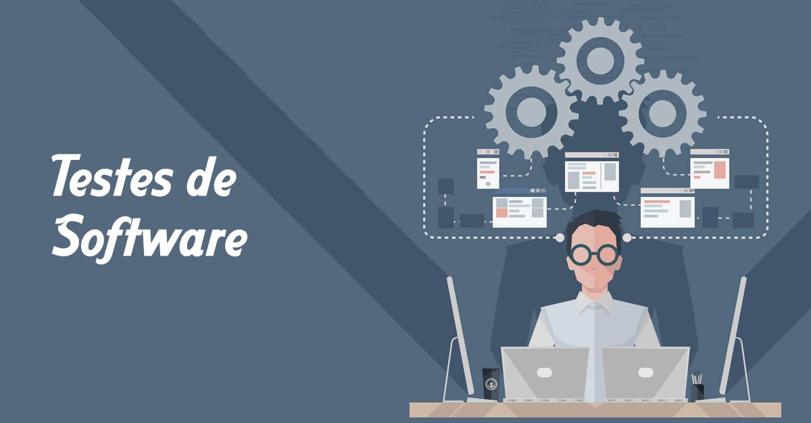

<!---->

  

# 
Processo de Teste de Software

<b>

Universidade Federal de Goiás

Instituto de Informática

Bacharelado em Enenharia de Software

INF303 Teste de Software - 2021/2

Professor: Gilmar Ferreira Arantes

Aluno 1:Matrícula:Nome

Aluno 2:Matrícula:Nome

Aluno 3:Matrícula:Nome

Aluno 4:Matrícula:Nome

Aluno 5:Matrícula:Nome

Aluno 6:Matrícula:Nome

</b>
## Histórico
|Versão|Data|Alteração|Autor|
|------|----|---------|-----|
|0.1|24/04/2019|Elaboração do Documento|gilmar.arantes|
|0.2|26/04/2019|Revisão da versão 0.1|gilmar.arantes|
|0.3|08/08/2019|Correções e Atualizações|gilmar.arantes|
|0.4|24/06/2020|Adaptação às novas tecnologias da STI|gilmar.arantes|

# Introdução

Fazer uma introdução ao processo de teste elaborado pelo grupo. Nesta introdução deverá informar se o processo de teste do grupo é para um projeto de desenvolvimento ou para um projeto de manutenção de software

<!---->

  
  <figcaption>Figura 1 - Etapas do Processo de Teste</figcaption>
  

 

Descrever em alto nível as etapas constituintes do processo, conforme Figura 1.

## Papéis
Descrever quais os papéis (roles) envolvidos no processo de teste.

## Ambiente de teste
Descrever o ambiente de testes, que envolve tanto software, quanto infraestrutura.

# Planejar
Descrever a fase de planejamento, junto com suas respectivas tarefas e papéis responsáveis. Criar um diagrama bpm para apresentar visualmente as atividades componentes desta fase.

## Atividade 1 (definir)
Descrever a atividade 1

### Responsável(eis)
 quais são os papéis envolvidos nesta atividade?

### Quando
quando a atividade deve ser executada?

### Como
como é a execução da atividade?

### Prazo
qual o prazo para execução?

### Entradas
quais são as entradas que subsidiam a execução?

### Saídas
quais são as saídas geradas pela execução?

### Fluxo:
qual a próxima atividade a ser executada na sequencia?

## Atividade 2

### Responsável

### Quando:

### como

### Prazo:

### Entradas:

### Saídas:

### Fluxo:

Identificar e descrever outras atividades componentes desta fase do processo.

# Projetar os Casos de Teste
Descrever a fase de Projetas os Casos de Teste, junto com suas respectivas tarefas e papéis responsáveis. Criar um diagrama bpm para apresentar visualmente as atividades componentes desta fase.

## Atividade 1

### Responsável

### Quando:

### como

### Prazo:

### Entradas:

### Saídas:

### Fluxo:

Identificar e descrever outras atividades componentes desta fase do processo.

# Executar
Descrever a Executar, junto com suas respectivas tarefas e papéis responsáveis. Criar um diagrama bpm para apresentar visualmente as atividades componentes desta fase.>

## Atividade 1

### Responsável

### Quando:

### como

### Prazo:

### Entradas:

### Saídas:

### Fluxo:

Identificar e descrever outras atividades componentes desta fase do processo.

# Entregar
Descrever a Entregas, junto com suas respectivas tarefas e papéis responsáveis. Criar um diagrama bpm para apresentar visualmente as atividades componentes desta fase.>

## Atividade 1

### Responsável

### Quando:

### como

### Prazo:

### Entradas:

### Saídas:

### Fluxo:

Identificar e descrever outras atividades componentes desta fase do processo.

# Considerações Finais
Descrever as considerações finais a respeito deste processo de teste de software.>
