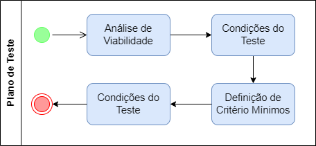
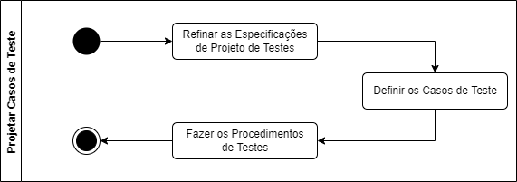
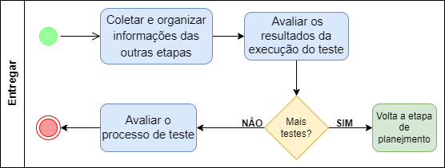

<!---->

  

# 
Processo de Teste de Software

<b>

Universidade Federal de Goiás

Instituto de Informática

Bacharelado em Enenharia de Software

INF303 Teste de Software - 2021/2

Professor: Gilmar Ferreira Arantes

Aluno 1: 201703739: André Maikel Soares Lopes

Aluno 2: 201703755: Gustavo Marques Reis

Aluno 3: 201709004: Fabiano Gomes Pires

Aluno 4: 201700281: Virgínia de Fernandes Souza

</b>
## Histórico

|Versão|Data|Alteração|Autor|
|------|----|---------|-----|
|0.1|29/01/2022|Criação do Documento|gustavo.marques|
|0.2|28/02/2022|Definição do Plano de Teste|fabianogomess|
|0.3|30/03/2022|Definição da fase Projetar os Casos de Teste|gustavo.marques|
|0.4|31/03/2022|Atualização responsáveis, definição da introdução|fabianogomess|
|0.5|04/04/2022|Atualizações finais|fabianogomess|

# Introdução

Este Processo de Teste de Software tem como objetivo estruturar as etapas, as atividades, os artefatos, os papéis e as responsabilidades do teste, permitindo organização e controle de todo o ciclo do teste, minimizando os riscos e agregando valor ao software. Este processo segundo seus idealizadores é ideal para um projeto de desenvolvimento, mas pode ser aplicado na manutenção de um produto, este processo foi pensado para acompanhar o software até sua aposentadoria, ou seja, pode ser aplicado futuramente no projeto em alguma atualização ou adição de uma nova funcionalidade.

<!---->

  
  <figcaption> Figura 1 - Etapas do Processo de Teste</figcaption>
  

 

* **Planejar**

    Nesta etapa procura-se entender, inicialmente as metas e objetivos do projeto e do cliente, os riscos do projeto escopo do trabalho. Os principais objetivos da etapa de planejamento são verificar a missão, definir os objetivos e as atividades de teste a serem realizadas.

* **Projetar**

  Nesta etapa, os casos de teste e scripts são elaborados, analisados e aplicados. Posteriormente, os dados são avaliados e editados novamente.

* **Executar**
  
  Nesta etapa, os profissionais de teste vão realizar as devidas validações considerando tudo o que foi apontado nos casos de teste. É necessário documentar os resultados dos testes, registrar os erros, reportar os problemas para a equipe de desenvolvimento e, após correção, refazer todas validações novamente.

* **Entregar**

  Nesta etapa, discute-se os resultados obtidos durante o ciclo de vida de teste, com o propósito de reduzir falhas e custos, além de otimizar os processos e cumprir os objetivos do negócio. É importante que seja elaborado um relatório de qualidade com a cobertura dos testes e os detalhes do projeto.

## Papéis

* Líder e gerente de teste (Essa função orienta o esforço geral de teste. Isso inclui a defesa da qualidade e dos testes, planejamento e gerenciamento de recursos e resolução de problemas que representam um obstáculo para o esforço de teste);
* Analista de Teste (É o responsável por identificar e definir os testes exigidos, monitorar o processo de teste em detalhes e os resultados em cada ciclo de teste e avaliar a qualidade geral. Deve garantir a qualidade dos componentes produzidos por meio da verificação de evidência de testes e utilização de técnicas especializadas em testes de programas e sistemas);
* Stakeholders (Referente às partes interessadas que devem estar de acordo com as práticas de governança corporativa executadas pela empresa, ou seja o cliente).

## Ambiente de teste
Definição do ambiente de teste:
* Este plano tem como objetivo atender projetos de desenvolvimento em MVC na linguagem JAVA. 
* O equipamento deve ter configurações minimas de 8gb de ram, um processador i5 ou similar, um ssd de 256GB e acesso a internet liberado.
* A IDE utilizada será o Eclipse. Será utilizada JUnit, para produzir e rodar os testes.
* A equipe de teste precisa de um espaço para reuniões e um ambiente com as máquinas para que a equipe possa trabalhar no processo.

# Planejar

  Esta é a primeira etapa do processo de teste, que envolve definir as atividades que determinam quais serão as abordagens dos testes, visando atingir os propósitos do cliente, tendo em vista todas as restrições impostas pelo contexto do projeto.
  
  Os principais objetivos da etapa de planejamento são verificar a missão, definir os objetivos e as atividades de teste a serem realizadas.
  
  É durante essa etapa que definimos o **Plano de Teste**, um documento que descreve o escopo, abordagem, recursos e cronograma das atividades de teste. Aqui, estão documentadas as exceções quanto à abordagem do teste, recursos a serem utilizados, equipe envolvida e as técnicas a serem aplicadas.
  Cada atividade aqui estabelecida irá gerar um tópico no Plano de Teste, desse modo ao final desta etapa, teremos o Plano de Teste, completo.
  
  Abaixo temos um diagrama BPM para apresentar visualmente as atividades componentes desta fase do processo de teste.

  

    
    <figcaption> Figura 2 - Fluxo de atividades do Plano de Teste</figcaption>
    

   

## Atividade 1: Análise de Viabilidade

  Nessa atividade deve-se analisar a viabilidade de se aplicar os testes no produto de software que está sendo desenvolvido. Identificar possíveis limitações que a equipe pode encontrar durante a execução dos testes e como tratá-las.

### Responsável(eis)

* Líder e gerente de teste.
* Analista de Teste.
* Stakeholders

### Quando

  Deve ser executada antes da implementação do software, e depois de se ter levantado e aprovado os requisitos do sistema. Pode ser executada em paralelo com o design e arquitetura do software.

### Como

  Em uma reunião ou reuniões, após definir e aprovar todos os requisitos, deve-se estudar a viabilidade do teste, junto com as limitações que podem ser encontradas no caminho. Se encontrar limitações é indispensável traçar planos para superá-las.

### Prazo

  Em média cinco dias.

### Entradas

* O documento de requisitos funcionais e não funcionais do software.

### Saídas

  O tópico “Análise de Viabilidade”, no documento Plano de Teste, deve estar completo.

### Fluxo

  A atividade 2, Condições do teste.

## Atividade 2: Condições do Teste

  É na atividade de Condições do Teste que as condições do teste são produzidas. Ou seja, define “o quê” será testado. Pode ser definida, de acordo com o BSTQB, como um item ou evento de um componente ou sistema que pode ser verificado por meio de um ou mais casos de teste. Ou seja, pode ser uma função, transação, característica, atributo de qualidade ou elemento estrutural. Tem como propósito transformar os objetivos do teste em algo tangível.

  Essa etapa do processo de teste tem o propósito de exercitar eficientemente as condições de uso do software, procurando atingir o máximo de cobertura com o mínimo de casos de teste.

### Responsável

* Líder e gerente de teste.
* Analista de Teste.
* Stakeholders

### Quando

  Após a atividade 1,  Análise de Viabilidade.

### Como

  Especificamos as condições de teste (cobertura de itens) para um item de teste (componente ou funcionalidade do software que deve ser testado), detalhando a abordagem do teste e identificando os casos de teste de alto nível associados.

### Prazo

  Aproximadamente dez dias.

### Entradas

* O documento de requisitos funcionais e não funcionais do software.
* O documento Plano de Teste - 1. Análise de Viabilidade.

### Saídas

  O tópico “ Condições do Teste”, no documento Plano de Teste, deve estar com todos os casos de teste que serão executados no processo.

### Fluxo

  A atividade 3, Definição de Critério Mínimos.

## Atividade 3: Definição de Critério Mínimos

Após ter feito a análise de viabilidade e definido as condições de teste, com base nesses dois itens, está na hora de definir os critérios mínimos de aceitação para cada condição de teste, ou caso de teste. Nessa etapa deve se estipular parâmetros de nível de qualidade esperados em cada caso de teste.

### Responsável

* Líder e gerente de teste.
* Analista de Teste.
* Stakeholders

### Quando

  Após a atividade 1, Análise de Viabilidade e a atividade 2,  Condições de Teste.

### Como

  Deve-se atribuir um nível de qualidade esperado para cada condição de teste descrita. Esse nível deve ser definido com base no escopo do e domínio do projeto e com base nos recursos disponíveis para a realização do processo de teste. Ao final dessa definição os stakeholders devem ser informados das decisões e acordarem sobre o nível de qualidade estabelecido.

### Prazo

  Em média cinco dias.

### Entradas

* O documento de requisitos funcionais e não funcionais do software.
* O documento Plano de Teste - 1. Análise de Viabilidade.
* O documento Plano de Teste - 2. Condições do Teste (os casos de teste definidos na atividade 2).

### Saídas

  O tópico “ Condições do Teste”, no documento Plano de Teste, deve estar com todos os casos de teste e seus respectivos níveis de aceitação.

### Fluxo

  A atividade 4, Modelagem do Setup

## Atividade 4: Modelagem do Setup

A atividade de modelagem do setup tem como objetivo definir qual o ambiente que o teste será executado, identificação de requisitos de infraestrutura e a identificação de ferramentas que serão utilizadas no processo de teste.

### Responsável

* Líder e gerente de teste.
* Analista de Teste.
* Stakeholders

### Como

  Inicialmente deve-se levantar os recursos de infraestrutura e ferramentas já disponíveis, verificar com em relação aos casos de teste, se as ferramentas atendem os casos de teste que vão ser executados. Após o levantamento e avaliação definir quais as ferramentas serão utilizadas, as já disponíveis ou novas.
  
  Além dos pontos de vista técnico tem que se levar em conta o ponto de vista do negócio e o valor disponível para adquirir novas ferramentas para a execução dos testes.
  
  As decisões tomadas devem ser registradas e justificadas do documento Plano de Teste e acordadas junto aos stakeholders.

### Prazo

  Em média cinco dias.

### Entradas

* O documento de requisitos funcionais e não funcionais do software.
* O documento Plano de Teste - 1. Análise de Viabilidade.
* O documento Plano de Teste - 2. Condições do Teste (completo agora).

### Saídas

  O tópico “ Modelagem do Setup”, no documento Plano de Teste, completo, com o ambiente e ferramentas, que serão utilizadas no processo de teste, definidas e justificadas.

  Com esse tópico finalizado, finaliza-se também o documento de Palno de Teste.

### Fluxo

Finaliza a fase de Planejar, podendo seguir para a fase de Projetar os Casos de Teste.

# Projetar os Casos de Teste

  A fase Projetar os Casos de Teste envolve atividades focadas em projetar e criar os casos de teste que serão utilizados na próxima fase. Para isto é necessário três atividades: especificar os casos de teste, criar os casos de teste e criar um guia de como executar os casos de teste.
  
  Ao final desta fase três artefetos deverão ter sidos gerados: Especicação do Projeto de Testes, Especicação dos Casos de Testes, Procedimentos de Testes.

  Abaixo temos um diagrama BPM para apresentar visualmente as atividades componentes desta fase do processo de teste.

  

    
    <figcaption> Figura 3 - Fluxo de atividades do Projetar os Casos de Testes</figcaption>
    

   

## Atividade 1: Refinar as Especificações de Projeto de Testes

Esta atividade tem como objetivo revisar o documento Especificações de Projeto de Testes feito na fase anterior, refinando-o e completando-o para ser utilizado na próxima atividade.

### Responsável

Analista de testes.

### Quando

Após a finalização da fase de planejamento.

### Como

Primeiramente será feito a refinagem da abordagem de teste de software definida no planejamento. Após refinar o documento, o analista deverá definir qual nível de teste será realizado (Teste de Unidade, Teste de Integração, Teste de Sistema) e com isto espeficar quais serão os casos de uso a serem utilizados para a criação de casos de teste

### Prazo

Em média cinco dias

### Entradas

* O documento Plano de Teste
* O documento Especificações de Projeto de Testes preeliminar
* O documento Casos de Uso

### Saídas

O documento "Especificação de Projeto de Testes" completo.

### Fluxo

A atividade 2, Definir os Casos de Teste.

## Atividade 2: Definir os Casos de Teste

A atividade de definição de casos de teste tem como objetivo criar os casos de teste que serão utilizados na fase Executar.

### Responsável

Analista de testes.

### Quando

Após a atividade 1, Refinar as Especificações de Projeto de Testes.

### Como

O responsável por esta atividade pegará os casos de uso definidos e irá criar um conjunto de dados de entrada e os respectivos resultados esperados da execução para os casos de uso, seguindo os critérios minímos e as especificações definidas. Caberá também ao responsável definir a prioridade de execução de cada caso, baseando-se na prioridade dos casos de uso, e quais casos de teste serão manuais e quais serão automatizados.

### Prazo

Em média dez dias

### Entradas

* O documento Plano de Teste
* O documento Especificações de Projeto de Testes
* O documento Casos de Uso

### Saídas

O documento "Especificação dos Casos de Teste" completo.

### Fluxo

A atividade 3, Fazer os Procedimentos de Testes.

## Atividade 3: Fazer os Procedimentos de Testes

A atividade de fazer os procedimentos de testes tem como objetivo criar os procedimentos de teste.

### Responsável

Analista de testes.

### Quando

Após a atividade 2, Definir os Casos de Teste.

### Como

O analista deverá criar para cada caso (ou um grupo de casos) de teste uma descrição dos passos necessários para executá-lo(s), seja ele manual ou automatizado, ou seja, será criado um manual para o testador seguir de como executar cado caso de teste.

### Prazo

Em média cinco dias

### Entradas

* O documento Especificação dos Casos de Teste

### Saídas

O documento "Procedimentos de Testes" completo.

### Fluxo

Finaliza a fase de Projetar, podendo seguir para a fase de Executar.

# Executar

## Atividade 1 - Executar Testes

Nesta etapa apresenta-se um modelo abrangente de processo de teste, o qual leva em consideração vários níveis de teste e atividades. É um modelo genérico, uma vez que não está ligado a teste de um tipo de software em particular, nem a um processo específico de desenvolvimento de software.
Seguindo o que é geralmente apresentado nessa etapa de teste de software, segue o Modelo V. Esse modelo considera as principais fases do processo de software, associando cada nível de teste de software relacionado. Neste modelo, o ramo esquerdo corresponde à preparação do teste de software, tendo como referencial os estágios do processo de desenvolvimento de software. Enquanto o ramo direito se relaciona à execução e registro do teste, se referenciando nos níveis de teste de software (figura XX).

<figure>
  
  <figcaption></figcaption>
</figure>

Nas etapas iniciais do processo de software é feita a preparação do teste que engloba o planejamento e o projeto de teste.
 A fase de especificação de requisitos é responsável pela elaboração dos requisitos do usuário que são usados para a determinação dos requisitos dos Teste de Aceitação, este por sua vez, verifica se o sistema satisfaz os requisitos do usuário.

Na fase de Especificação do Sistema, ocorre a produção das especificações Funcionais e Não Funcionais, usadas para a determinação dos requisitos do Teste de Sistema. Já o teste de sistema é responsável pela verificação das funções, se estão ou não implementadas e se as suas características estão satisfazendo os requisitos.

A fase de Projeto do Sistema abarca a produção da arquitetura do sistema e estabelece as relações entre os componentes do sistemas usados para a determinação do Teste de integração. É no teste de Integração que ocorre a verificação desses relacionamentos, sua própria  existência e se estes estão implementados corretamente.

 Na fase de projeto de unidade ocorre a produção do projeto dos módulos do sistema utilizado para determinação dos requisitos do Teste de Unidade. Este testes é responsável por verificar se esses módulos estão codificados corretamente.

<h4>Preparação para o teste de software</h4>

O Plano de Teste é,inicialmente, elaborado  a partir dos requisitos do usuário. As
especificações funcionais e não funcionais são utilizadas para refinamento do plano de teste, que pode ser mais detalhado a partir da definição da arquitetura do sistema. Ou seja, o plano de teste é produzido a partir dos artefatos que foram gerados nas fases de especificação de
requisitos, especificação do sistema e projeto do sistema e é complementado com informações
geradas nas especificações de projeto de teste

O Projeto de Teste de Aceitação é elaborado, em sua versão inicial, a partir dos
requisitos do usuário. Durante essa fase, os requisitos do usuário definidos não contêm informações suficientes para a especificação dos casos de teste nem para a especificação dos
procedimentos de teste, que devem ser completamente especificadas posteriorermente. Apesar disso, já podem ser estabelecidos os critérios de Teste de Aceitação do Sistema.

O Projeto de Teste de Sistema é elaborado partindo das especificações funcional e não
funcional do sistema, o que também inclui as informações da especificação de casos de teste e da especificação de Procedimentos de Teste

O Projeto de Teste de Integração é elaborado a partir da arquitetura do sistema, e
inclui as informações da especificação de casos de teste e da especificação de
procedimentos de teste.

Por fim, o Projeto de Teste de Unidade é desenvolvido partindo do projeto de Unidade, e inclui as informações da especificação de casos de teste e da especificação de procedimentos de teste.

<h4>Execução do teste de software</h4>
<h4>Fluxograma de execução do teste de software</h4>

A figura(XX) ilustra o fluxo de execução do teste de spftware de um processo genérico de teste, nesa constam os níveis de teste.

O teste de uma unidade começa após o término de sua codificação e processa-se
através de ciclos de detecção de falhas e de alterações para corrigi-las.

Para testar uma unidade são aplicadas as seguintes técnicas de teste:

<ul>
<li>
Técnica Estrutural - técnica na qual os seguintes critérios para a geração dos casos de teste podem ser adotados: Teste de Comandos, Teste de Ramos, Teste de caminhos, Teste de Caminhos Básicos, Teste de Condições, Teste de Condições Múltiplas, Teste de Laços, Teste de Fluxo de Dados.

</li>
<li>
Técnica Funcional- técnica na qual os seguintes critérios para a geração dos casos de teste podem ser adotados: Particionamento de Equivalência, Análise de Valores Limites, Teste Baseado em Casos de Uso, Grafo de Causas e Efeito, Teste Baseado em Tabelas de Decisão, Teste Baseado em Máquinas de Estados. 
</li>
</ul>

Os testes de funcionalidade, desempenho, confiabilidade, usabilidade, e outros, podem  ser utilizados a depender das características da unidade que está sendo testada e também dos objetivos do teste.  

O teste de aceitação inicia-se depois da conclusão do teste de sistema. O teste de aceitação se processa através de detecção de problemas e de alterações. Para esse teste, todas as técnicas de todos os tipos de teste sao aplicados no teste de sistema. Embora um processo de teste não precise necessariamente incluir todos os níveis de teste.

<figure>
  
  <figcaption></figcaption>
</figure>

### Responsável

Analistas de teste

### Quando

A atividade executar ocorre após a determinação do procedimento de teste.

### como

Executando o estabelecido no plano de testes.

### Prazo

Vai depender da complexidade do sistema, mas em média 10 dias.

### Entradas

<ul>
<li>

Plano de Teste

</li>
<li>

Itens de Teste

</li>
</ul>

### Saídas

 Os artefatos de saída são:
 <ul>
 <li>
 
Relatório de Incidente de Teste

 </li>
 <li>
 
Relatório Resumo de Teste

 </li>
 </ul>

### Fluxo

Finalizada a fase Executar, segue-se para a fase Entregar.

Identificar e descrever outras atividades componentes desta fase do processo.

# Entregar

A etapa de Entregar do teste, é onde coletamos todos os dados de todas as outras etapas para consolidar a experiência final obtida, a documentação gerada pelo processo de teste como planos de teste, condições de teste, casos de teste, base de teste utilizada, etc., fatos e números consolidados.

Nesta etapa ainda checamos se todos os entregáveis planejados foram realmente entregues, fechamos relatórios e incidentes, documentamos o aceite do sistema, finalizamos e arquivamos o testware, ambientes de teste, infraestrutura de teste para reuso, analisamos as lições aprendidas para determinar as mudanças para futuros projetos, e melhoramos a maturidade dos testes com as informações obtidas.

 

    
    <figcaption> Figura 6 - Fluxo de atividades do Entregar</figcaption>
    

   

## Atividade 1: Coletar e organizar informações das outras etapas
Esta atividade irá focar em reunir e organizar os artefatos que foram produzidos durante todo o processo de teste. É preciso organizar os artefatos em artefatos do processo e artefatos da execução dos casos de teste, este primeiro relacionado ao processo, documentos que dizem respeito como o processo deve ser executado, já o segundo, artefatos de execução dos casos de teste, são os casos de teste, suas descrições e metas e os resultados obtidos após a fase de execução.
### Responsável
  * Analista de Testes
### Quando:
Após o encerramento da fase de Executar os Testes.
### Como:
Reunir todas as informações desde a definição do processo de testes e os dados de execução dos testes, separar um arquivo com os dados do processo e outro com os dados obtidos a partir da execução dos testes. 
### Prazo:
Em média cinco dias.
### Entradas:
  * Plano de Testes
  * Relatório de incidentes de teste 
  * Diário de Testes.
### Saídas:
Relação de documentos preparatórios para a construção do Relatório sumário dos testes.
### Fluxo:
Atividade 2: Avaliar os resultados da execução do teste.
Esta atividade tem como objetivo validar os resultados dos casos de teste do ponto de vista da qualidade de software, visando averiguar se os resultados obtidos são satisfatórios aos níveis de qualidade estabelecidos no início do processo. 
## Atividade 2: Avaliar os resultados da execução do teste.
Esta atividade tem como objetivo validar os resultados dos casos de teste do ponto de vista da qualidade de software, visando averiguar se os resultados obtidos são satisfatórios aos níveis de qualidade estabelecidos no início do processo. 
### Responsável
  * Analista de Testes
### Quando:
Após a Atividade 1: Coletar e organizar informações das outras etapas
### Como:
Avaliar os dados de execução do teste e verificar se atende as métricas estabelecidas no começo do processo no Plano de Teste. Verificar se todos os pontos críticos do sistema foram cobertos pelo teste e se os resultados atendem as expectativas definidas inicialmente.
### Prazo:
Em média dez dias.
### Entradas:
  * Relação de documentos obtidos na Atividade 1: Coletar e organizar informações das outras etapas.

### Saídas:
Relatório sumário dos testes.
### Fluxo:
Se os resultados obtidos no teste são satisfatórios e atendem às expectativas definidas no início do processo de software, a próxima etapa é a Atividade 3: Avaliar o processo de teste. 
Caso não atenda as expectativas deve voltar a etapa 1: Planejamento e rever o plano de testes, executar um novo processo de teste a fim de atender ao nível de qualidade esperado do projeto.
## Atividade 3:  Avaliar o processo de teste
Atividade onde se vai avaliar todo o processo de teste que foi executado pela equipe de  teste.
### Responsável
  * Líder e gerente de teste.
  * Analista de Teste.
### Quando:
Após a conclusão da Atividade 2: Avaliar os resultados da execução do teste.
### Como:
Avaliar o processo de teste, pontos positivos e negativos, pontos que funcionaram e não funcionaram durante a execução do processo, relatar todas as informações e considerá-las na próxima vez que o processo de teste for ser executado pela equipe. Na avaliação pode se selecionar casos de teste considerados padrão e serem catalogados para serem usados em outro projeto, já que estão todos bem definidos podem ser reutilizados com tranquilidade em projetos futuros. 
### Prazo:
Em média dez dias.
### Entradas:
  * Todos os artefatos produzidos durante o processo.
### Saídas:
  * Relatório do processo de teste.
  * Catálogo de casos de teste.
### Fluxo:
Fim do processo.
# Considerações Finais

De acordo com o observado por este trabalho, o processo de software deve ser tratado como mais um processo de software e portanto integrado ao desenvolvimento de software e tambem deve iniciar concomitantemente ao projeto de favorecendo a retroalimentação entre os processos. Todo o processo de teste tem que estar muito bem definido e caracterizado para que o desenvolvimento do software tenha um bom progresso e uma qualidade final assegurada.

As ferramentas de gerenciamento de casos de teste e de controle de "bugs" são atuantes na melhoria do processo de teste de software, contribuindo grandemente para a documentação e gerência do processo de teste.

A documentação do processo, somado às ferramentas contribuem de forma muito significativa na entrega de um produto final de qualidade e que atenda às espectativas do cliente.

