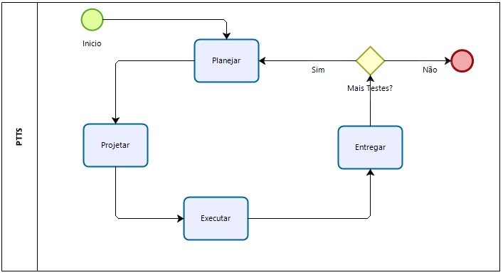
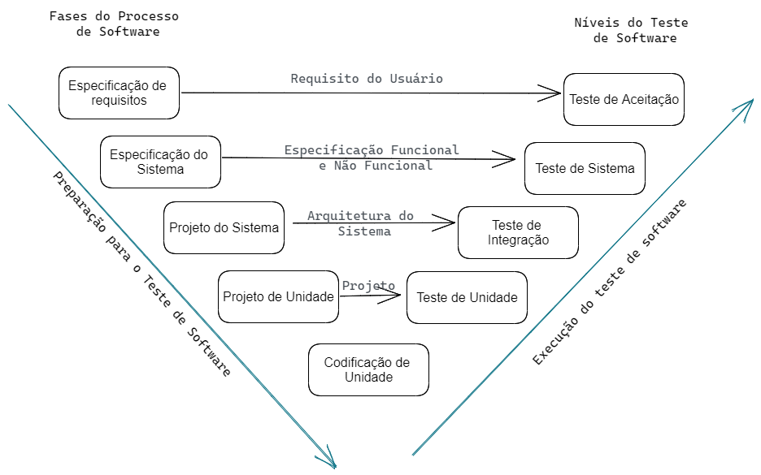
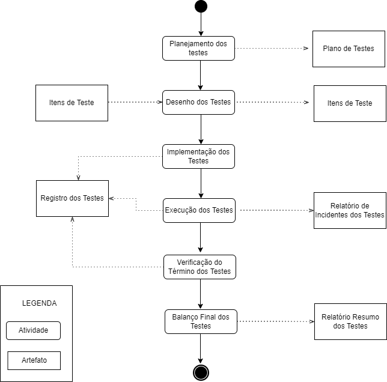

<!---->

  

# 
Processo de Teste de Software

<b>

Universidade Federal de Goiás

Instituto de Informática

Bacharelado em Enenharia de Software

INF303 Teste de Software - 2021/2

Professor: Gilmar Ferreira Arantes

Aluno 1:201703739:André Maikel Soares Lopes

Aluno 2:201703755:Gustavo Marques Reis

Aluno 3:201709004:Fabiano Gomes Pires

Aluno 4:201700281:Virgínia de Fernandes Souza

</b>
## Histórico

|Versão|Data|Alteração|Autor|
|------|----|---------|-----|
|0.1|29/01/2022|Criação do Documento|gustavo.marques|

# Introdução

Fazer uma introdução ao processo de teste elaborado pelo grupo. Nesta introdução deverá informar se o processo de teste do grupo é para um projeto de desenvolvimento ou para um projeto de manutenção de software

<!---->

  
  <figcaption> Figura 1 - Etapas do Processo de Teste</figcaption>
  

 

Descrever em alto nível as etapas constituintes do processo, conforme Figura 1.

## Papéis

Descrever quais os papéis (roles) envolvidos no processo de teste.

## Ambiente de teste

Descrever o ambiente de testes, que envolve tanto software, quanto infraestrutura.

# Planejar

Descrever a fase de planejamento, junto com suas respectivas tarefas e papéis responsáveis. Criar um diagrama bpm para apresentar visualmente as atividades componentes desta fase.

## Atividade 1 (definir)

Descrever a atividade 1

### Responsável(eis)

 quais são os papéis envolvidos nesta atividade?

### Quando

quando a atividade deve ser executada?

### Como

como é a execução da atividade?

### Prazo

qual o prazo para execução?

### Entradas

quais são as entradas que subsidiam a execução?

### Saídas

quais são as saídas geradas pela execução?

### Fluxo

qual a próxima atividade a ser executada na sequencia?

## Atividade 2

### Responsável

### Quando

### como

### Prazo

### Entradas

### Saídas

### Fluxo

Identificar e descrever outras atividades componentes desta fase do processo.

# Projetar os Casos de Teste

Descrever a fase de Projetas os Casos de Teste, junto com suas respectivas tarefas e papéis responsáveis. Criar um diagrama bpm para apresentar visualmente as atividades componentes desta fase.

## Atividade 1

### Responsável

### Quando

### como

### Prazo

### Entradas

### Saídas

### Fluxo

Identificar e descrever outras atividades componentes desta fase do processo.

# Executar

<h3>Execução de teste de software - </h3>

Nesta etapa apresenta-se um modelo abrangente de processo de teste, o qual leva em consideração vários níveis de teste e atividades. É um modelo genérico, uma vez que não está ligado a teste de um tipo de software em particular, nem a um processo específico de desenvolvimento de software.
Seguindo o que é geralmente apresentado nessa etapa de teste de software, segue o Modelo V. Esse modelo considera as principais fases do processo de software, associando cada nível de teste de software relacionado. Neste modelo, o ramo esquerdo corresponde à preparação do teste de software, tendo como referencial os estágios do processo de desenvolvimento de software. Enquanto o ramo direito se relaciona à execução e registro do teste, se referenciando nos níveis de teste de software (figura XX).

<figure>
  
  <figcaption></figcaption>
</figure>

Nas etapas iniciais do processo de software é feita a preparação do teste que engloba o planejamento e o projeto de teste.
 A fase de especificação de requisitos é responsável pela elaboração dos requisitos do usuário que são usados para a determinação dos requisitos dos Teste de Aceitação, este por sua vez, verifica se o sistema satisfaz os requisitos do usuário.

Na fase de Especificação do Sistema, ocorre a produção das especificações Funcionais e Não Funcionais, usadas para a determinação dos requisitos do Teste de Sistema. Já o teste de sistema é responsável pela verificação das funções, se estão ou não implementadas e se as suas características estão satisfazendo os requisitos.

A fase de Projeto do Sistema abarca a produção da arquitetura do sistema e estabelece as relações entre os componentes do sistemas usados para a determinação do Teste de integração. É no teste de Integração que ocorre a verificação desses relacionamentos, sua própria  existência e se estes estão implementados corretamente.

 Na fase de projeto de unidade ocorre a produção do projeto dos módulos do sistema utilizado para determinação dos requisitos do Teste de Unidade. Este testes é responsável por verificar se esses módulos estão codificados corretamente.

<h4>Preparação para o teste de software</h4>

O Plano de Teste é,inicialmente, elaborado  a partir dos requisitos do usuário. As
especificações funcionais e não funcionais são utilizadas para refinamento do plano de teste, que pode ser mais detalhado a partir da definição da arquitetura do sistema. Ou seja, o plano de teste é produzido a partir dos artefatos que foram gerados nas fases de especificação de
requisitos, especificação do sistema e projeto do sistema e é complementado com informações
geradas nas especificações de projeto de teste

O Projeto de Teste de Aceitação é elaborado, em sua versão inicial, a partir dos
requisitos do usuário. Durante essa fase, os requisitos do usuário definidos não contêm informações suficientes para a especificação dos casos de teste nem para a especificação dos
procedimentos de teste, que devem ser completamente especificadas posteriorermente. Apesar disso, já podem ser estabelecidos os critérios de Teste de Aceitação do Sistema.

O Projeto de Teste de Sistema é elaborado partindo das especificações funcional e não
funcional do sistema, o que também inclui as informações da especificação de casos de teste e da especificação de Procedimentos de Teste

O Projeto de Teste de Integração é elaborado a partir da arquitetura do sistema, e
inclui as informações da especificação de casos de teste e da especificação de
procedimentos de teste.

Por fim, o Projeto de Teste de Unidade é desenvolvido partindo do projeto de Unidade, e inclui as informações da especificação de casos de teste e da especificação de procedimentos de teste.

<h4>Execução do teste de software</h4>
<h4>Fluxograma de execução do teste de software</h4>

A figura(XX) ilustra o fluxo de execução do teste de spftware de um processo genérico de teste, nesa constam os níveis de teste.

O teste de uma unidade começa após o término de sua codificação e processa-se
através de ciclos de detecção de falhas e de alterações para corrigi-las.

Para testar uma unidade são aplicadas as seguintes técnicas de teste:

<ul>
<li>
Técnica Estrutural - técnica na qual os seguintes critérios para a geração dos casos de teste podem ser adotados: Teste de Comandos, Teste de Ramos, Teste de caminhos, Teste de Caminhos Básicos, Teste de Condições, Teste de Condições Múltiplas, Teste de Laços, Teste de Fluxo de Dados.

</li>
<li>
Técnica Funcional- técnica na qual os seguintes critérios para a geração dos casos de teste podem ser adotados: Particionamento de Equivalência, Análise de Valores Limites, Teste Baseado em Casos de Uso, Grafo de Causas e Efeito, Teste Baseado em Tabelas de Decisão, Teste Baseado em Máquinas de Estados. 
</li>
</ul>

Os testes de funcionalidade, desempenho, confiabilidade, usabilidade, e outros, podem  ser utilizados a depender das características da unidade que está sendo testada e também dos objetivos do teste.  

O teste de aceitação inicia-se depois da conclusão do teste de sistema. O teste de aceitação se processa através de detecção de problemas e de alterações. Para esse teste, todas as técnicas de todos os tipos de teste sao aplicados no teste de sistema. Embora um processo de teste não precise necessariamente incluir todos os níveis de teste.

<figure>
  
  <figcaption></figcaption>
</figure>

Descrever a Executar, junto com suas respectivas tarefas e papéis responsáveis. Criar um diagrama bpm para apresentar visualmente as atividades componentes desta fase.>

## Atividade 1

### Responsável

### Quando

### como

### Prazo

### Entradas

### Saídas

### Fluxo

Identificar e descrever outras atividades componentes desta fase do processo.

# Entregar

Descrever a Entregas, junto com suas respectivas tarefas e papéis responsáveis. Criar um diagrama bpm para apresentar visualmente as atividades componentes desta fase.>

## Atividade 1

### Responsável

### Quando

### como

### Prazo

### Entradas

### Saídas

### Fluxo

Identificar e descrever outras atividades componentes desta fase do processo.

# Considerações Finais

Descrever as considerações finais a respeito deste processo de teste de software.
